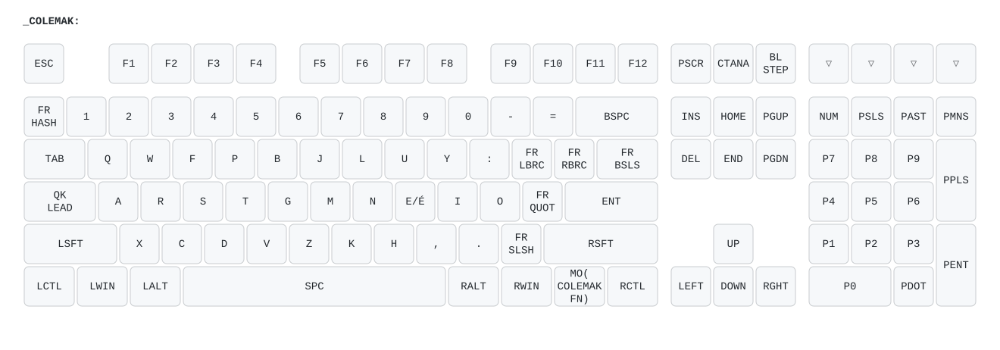

# Journey into bilingual Colemak-DH

## Intro

I've tried for a few weeks with the following configuration:

- Default (QWERTY) layer on "Win" layer
- Colemak-DH with Angle mod on "Mac" layer (physical switch at the back of the keyboard)
- Colemak-DH with Angle mod on 5th layer, accessible upon double tap on RWin

This last layer differed from the other Colemak one (layer 0) by a few French Canadian specific aliases, notably for `é` and a few dead keys.

My rationale was that I needed to have an English/coding oriented layer, while the French layer would be separate for punctual use.

In the end, I find almost all keys too far to reach, especially `` ` `` (above `Enter`) and decided to use a leader key (`CAPS`) to define combos.

## Latest improvements

Leader combos:
- QK_LEAD (`CAPS`), `a` = `à`
- QK_LEAD (`CAPS`), `u` = `ù`
- QK_LEAD (`CAPS`), `c` = `ç`

I'm now typing `é` by double tapping `e` (tap dance). It's intuitive, practical (given its frequency in French) and so far I love it. Unfortunately it's kinda difficult to combine with a leader combo.
In order to remedy this, I'm temporarily using `n` to type `è` and `ê`:
- QK_LEAD (`CAPS`), `n` = `è`
- QK_LEAD (`CAPS`), `f`, `n` = `ê`

Leader combos are being tested and are likely to change.

## Visual

Using [keymap-drawer](https://github.com/caksoylar/keymap-drawer/tree/main), I generated [a YAML](./keymap.yaml) with `qmk c2json --no-cpp keymap.c | keymap parse -c 10 -q - >keymap.yaml`.

Then, I edited manually and generated a SVG with `keymap draw keymap.yaml -j ../../../../info.json >keymap.svg`

> [!WARNING]
> The visual **only** includes **basic** stuff and therefore doesn't currently display shifts, leader combos or tap dance actions. 

## Roadmap

- [ ] 3-key leader combos should actually be: leader, deadkey
- [ ] Deal with `` ` `` (chording would require two letters that are never adjacent in French or English... maybe not the best)
- [ ] Pool layers `COLEMAK` and `COLEMAK_FR`